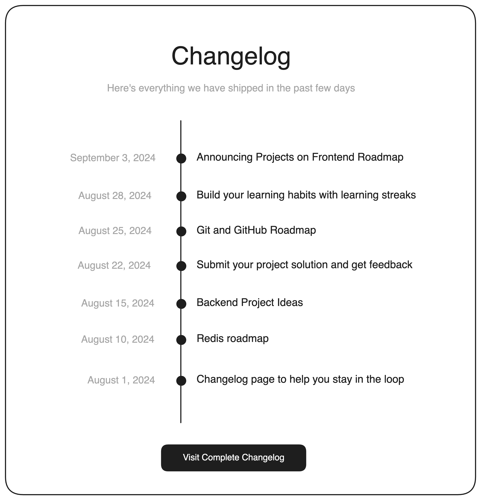

## Changelog Component

### Description
In this project, I am required to create a simple component for a website that displays a changelog. A changelog is a log or record of all notable changes made to a project or software. It is often used to inform users about the latest updates and improvements.

This project aims to teach me about positioning and layout in CSS. I created a simple HTML structure and used CSS to style it into a visually appealing and responsive changelog component. Below is a rough mockup of the changelog component I needed to create.



Feel free to customize the design and layout of the component as you see fit. The focus should be on creating a well-structured and responsive component that can be easily integrated into a website. 

After completing this project, I was able to have a good understanding of how to create simple layouts using HTML and CSS. You can further enhance your skills by exploring more complex layouts, such as grids and flexbox, in future projects. 

### How to view this project:
1. Clone the repository
    ```bash
    git clone https://github.com/Ifram3/changelog-component.git
    ```
2. Navigate to the project directory and open the `index.html` file in any  modern web browser to view the website.

### Technologies used:
- **HTML5** for structuring the page semantically
- **CSS3** for styling the page and creating the layout
- **Flexbox** for creating responsive layouts.
- **Google Fonts** for typography.

### Acknowledgements
Website Template Inspired by [Roadmap.sh](https://roadmap.sh/projects/changelog-component) And you can still checkout the project [here](https://roadmap.sh/projects/changelog-component)
