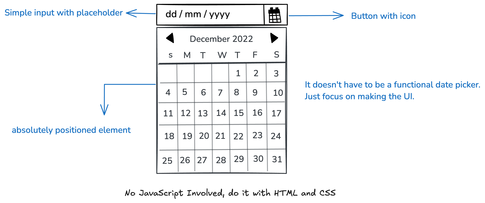

## Datepicker UI

## Description
In this project, I am required to create a simple datepicker UI using only HTML and CSS. It will not be a functional datepicker, but a static UI component that you can later enhance with JavaScript.

The goal of this project is to help me practice positioning, layout, and styling techniques in CSS. Below is a rough mockup showing the datepicker UI you need to create.



Feel free to customize the colors, fonts, and overall design to match your style.

### How to view this project:
1. Clone this repository to your local machine.
   ```bash
   git clone https://github.com/Ifram3/datepicker-ui.git
   ```
2. Open the `index.html` file in your preferred web browser to view the datepicker UI.

3. You can also open the `style.css` file in your preferred code editor to view.

### Technologies used:
- **HTML5** for structuring the page semantically
- **CSS3** for styling and layout
- **Git** for version control
- **Flexbox** for creating flexible and reposnsive layouts
- **CSS Selectors** for selecting and styling elements based on their attributes and relationships
- **CSS Units** for defining the size and position of elements
- **CSS Box Model** for defining the layout of elements
- **CSS Positioning** for defining the position of elements
- **Icons** to visually represent an the calender object

### Aknowledgements 
Website Template Inspired by [Roadmap.sh](https://roadmap.sh/projects/datepicker-ui) And you can still checkout the project [here](https://roadmap.sh/projects/datepicker-ui)

