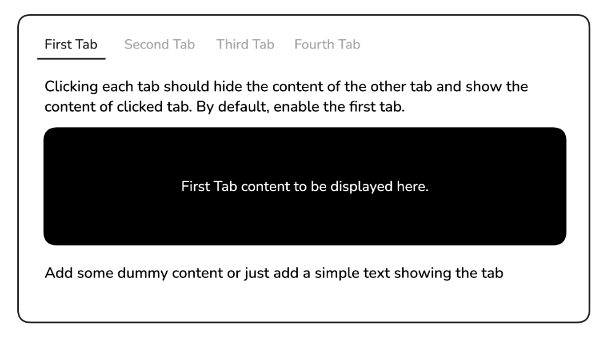

# Simple Tabs

## Description
This project is designed to introduce you to basic DOM manipulation and event handling in JavaScript.

You are required to create a simple tabs functionality using HTML, CSS, and basic JavaScript. The page will have four tabs, with the first tab being active by default. When the user clicks on another tab, the content of the current tab will be hidden, and the content of the selected tab will be displayed.

This project will help you practice selecting elements with JavaScript, listen for click events, and manipulate the dom to show or hide relevant tab content.



### How to view this project:
1. Clone this repository to your local machine.
    ```
    git clone https://github.com/Ifram3/simple-tabs.git
   ```
2. Open the `index.html` file in your preferred web browser to view the Tabs.
3. You can also open the `style.css` file in your preferred code editor to view.

### Technology used
- **HTML** for semantic structure.
- **CSS** for styling, layout, and controlling visibility.
- **CSS Variables** for reusable sizing.
- **Flexbox** for horizontal tab alignment.
- **JavaScript** for DOM querying, and event handling.

### Aknowledgments
Website Template Inspired by [Roadmap.sh](https://roadmap.sh/projects/simple-tabs) And you can still checkout the project [here](https://roadmap.sh/projects/simple-tabs)