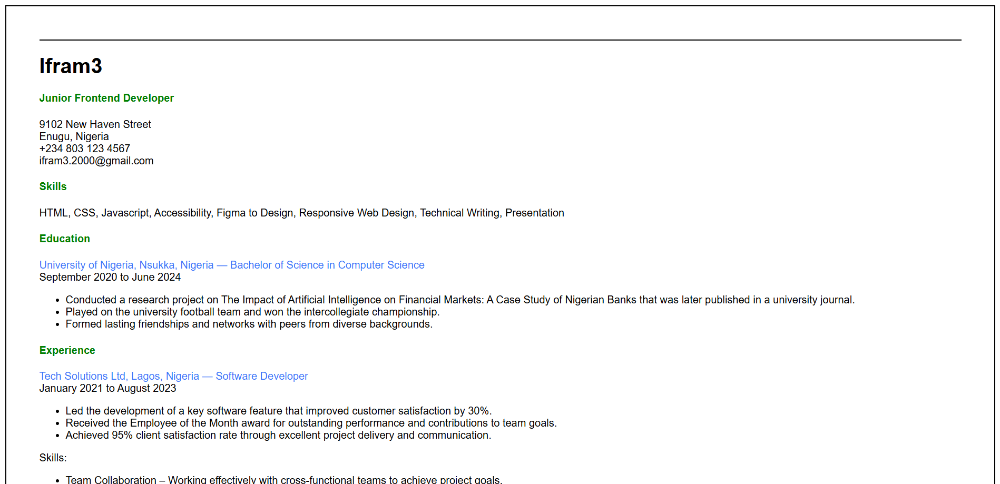
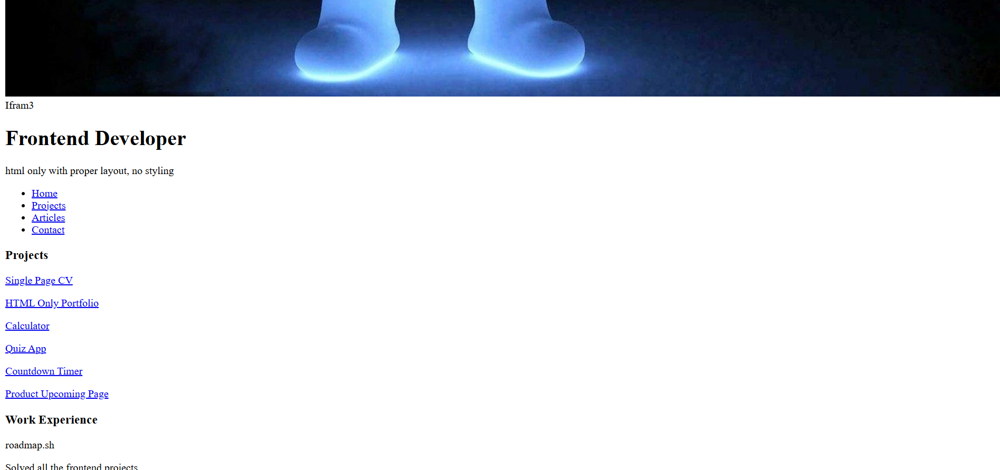
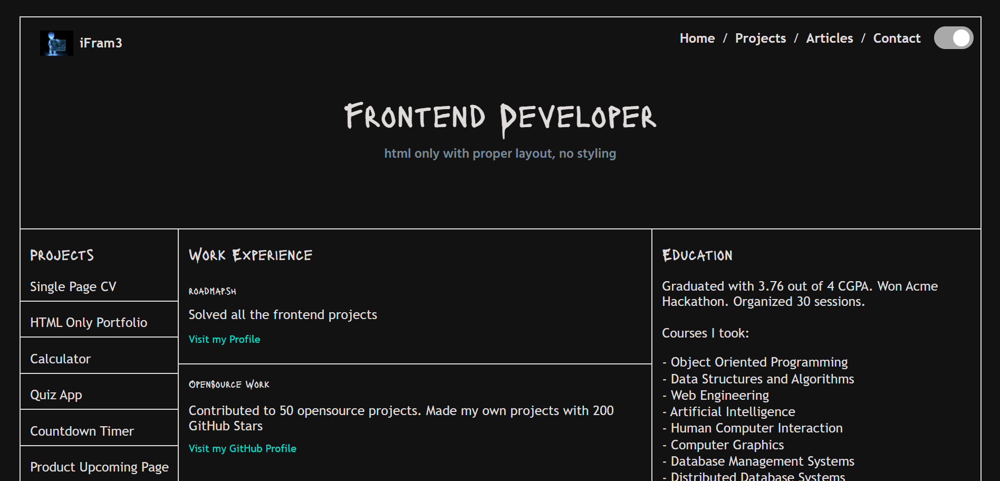
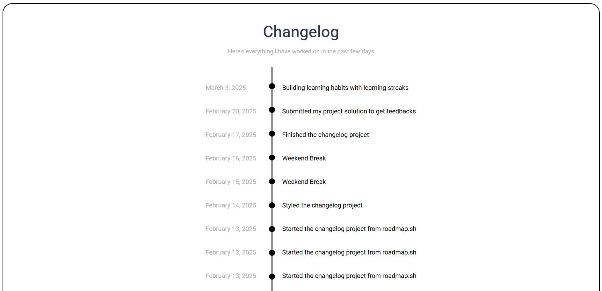
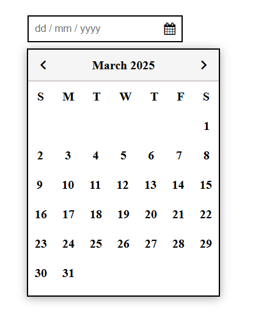
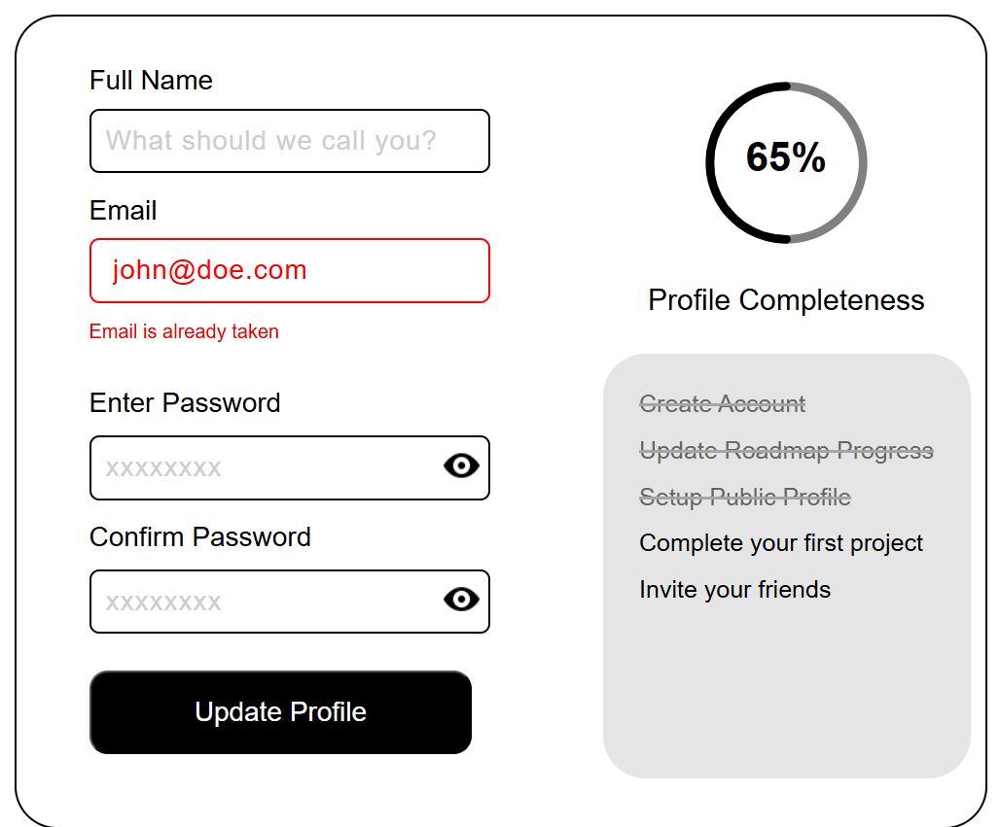

# roadmap.sh-projects

## Frontend Projects

A collection of front-end development projects based on the roadmap.sh guide showcasing my progress and practice with HTML, CSS, and JavaScript. They include the following👇

<table>

  <tr>
    <td>
      <h2><a href="https://roadmap.sh/projects/single-page-cv">Single Page CV</a></h2>
      
    </td>
    <td>
      <h2><a href="https://roadmap.sh/projects/basic-html-website">Basic HTML Website</a></h2>
      
    </td>
    <td>
      <h2><a href="https://roadmap.sh/projects/portfolio-website">Personal Portfolio</a></h2>
      
    </td>
  </tr>

  <tr>
    <td>
        <h2><a href="https://roadmap.sh/projects/changelog-component">Changelog Component</a></h2>
        
    </td>
    <td>
      <h2><a href="https://roadmap.sh/projects/testimonial-cards">Testimonial Cards</a></h2>
      
    </td>
    <td>
      <h2><a href="https://roadmap.sh/projects/datepicker-ui">Datepicker UI</a></h2>
      
    </td>
  </tr>

  <tr>
    <td>
        <h2><a href="https://roadmap.sh/projects/accessible-form-ui">Accessible Form UI</a></h2>
        
    </td>
  </tr>

</table>

